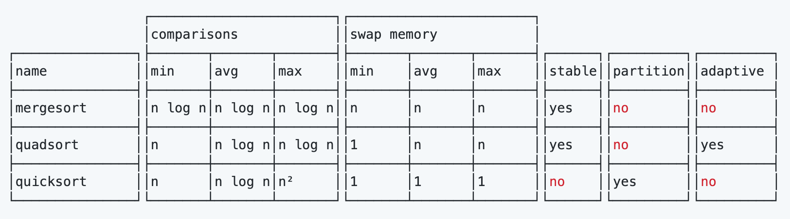
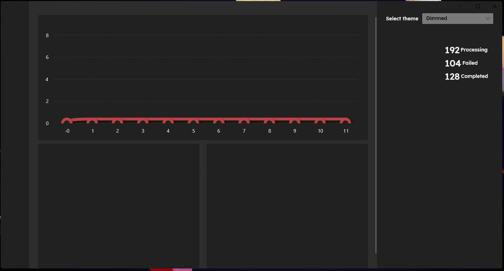
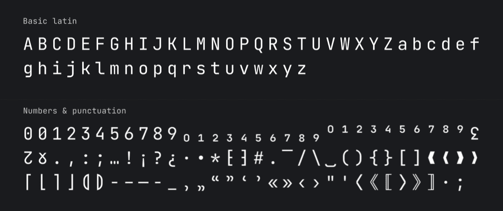

# Hello github records

This project is used for recording all project and ideas which I'm interested in. All those interesting projects come from project [hello-github](https://hellogithub.com/). And the ideas come from everywhere.

## 69
### [quadsort](https://github.com/scandum/quadsort)
一种比快速排序快，稳定的归并排序算法。项目包含原理讲解、C 语言实现、性能对比和排序过程


### [minilisp](https://github.com/rui314/minilisp) ~hard and boring!!!~ Jump to [chibicc](#chibicc)
用 1000 行 C 语言写的 Lisp 解释器。实现了整数、符号、局部变量、条件语句、宏和垃圾回收等功能，为了让读者更好地理解项目，代码中包含了丰富的注释
```
(println 3)  ; prints "3"
(+ 1 2 3)  ; -> 6
(define a (+ 1 2))
(+ a a)  ; -> 6
```

## 70
### [tinyssh](https://github.com/janmojzis/tinyssh)
极简 SSH 服务器。为了便于学习仅保留了基础功能，而且抛弃了较旧的加密算法。该项目的学习价值大于实用价值，适合对 SSH 和加密知识感兴趣的小伙伴

### [LiveCharts2](https://github.com/beto-rodriguez/LiveCharts2)
简单、灵活、强大的 .Net 图表库。支持 WPF、WinForms、WinUI、UWP 等


### [JetBrainsMono](https://github.com/JetBrains/JetBrainsMono)
JetBrains 为开发者开源的免费字体。该字体形状简单没有不必要的细节，从而阅读起来十分轻松而且小尺寸时显示更加清晰


## 71
### [chibicc](https://github.com/rui314/chibicc)
A small C compiler. It's fun to read it from the [first commit](https://github.com/rui314/chibicc/commit/0522e2d77e3ab82d3b80a5be8dbbdc8d4180561c)

### [pure bash bible](https://github.com/dylanaraps/pure-bash-bible)
It's a book which documents commonly-known and lesser-known methods of doing various tasks using only built-in `bash` features.

### [How to Cook](https://github.com/Anduin2017/HowToCook)
Programmer's guide about how to cook at home (Chinese only).[Related website](https://cook.aiurs.co/)

### [Article](https://github.com/HelloGitHub-Team/Article)
This is a collection of articles that guide beginners on their first project in Github.

## 72
### [hashcat](https://github.com/hashcat/hashcat)
hashcat is the world's fastest and most advanced password recovery utility, supporting five unique modes of attack for over 300 highly-optimized hashing algorithms. hashcat currently supports CPUs, GPUs, and other hardware accelerators on Linux, Windows, and macOS, and has facilities to help enable distributed password cracking.
```
安装：brew install hashcat
常用参数：
-a  指定破解模式：“-a 0”字典攻击，“-a 1” 组合攻击；“-a 3”掩码攻击
-m  指定要破解的 hash 类型：默认为 MD5
--force 忽略破解过程中的警告
常用破解模式：
0：Straight（字典破解）
1：Combination（组合破解）
3：Brute-force（掩码暴力破解）
6：Hybrid Wordlist + Mask（字典+掩码破解）
7：Hybrid Mask + Wordlist（掩码+字典破解）
常用掩码设置：
l：纯小写字母 abcdefghijklmnopqrstuvwxyz
u：纯大写字母 ABCDEFGHIJKLMNOPQRSTUVWXYZ
d：纯数字 0123456789
举例：破解 8 位数字密码
hashcat -a 3 -m 0 --force 0D7002A70CCDE8BF4BA2A4A5572A85E9(密码md5字符串) ?l?l?l?l?l?l?l?l?l?l?l（11 位密码的掩码）
```


### [Monitorian](https://github.com/emoacht/Monitorian)
Monitorian is a Windows desktop tool to adjust the brightness of multiple monitors with ease.


### [reveal.js](https://github.com/hakimel/reveal.js)
reveal.js is an open source HTML presentation framework. It enables anyone with a web browser to create beautiful presentations for free. 


### [awesome-phd-advice](https://github.com/pliang279/awesome-phd-advice)
Collection of advice for prospective and current PhD students. 


### [wiki.js](https://github.com/requarks/wiki)
Wiki.js | A modern and powerful wiki app built on Node.js. Help you build your own website like wiki. It's simple and fast website building tool.

## 73
### [warpd](https://github.com/rvaiya/warpd)
用键盘代替鼠标的工具。拥有多种操作模式比如方向键移动鼠标和区域选择，但仅支持 Linux 和 macOS 系统


### [rubiks-cube](https://github.com/pengfeiw/rubiks-cube)
使用 Three.js 制作的 3D 魔方。支持自定义魔方阶数，[在线尝试](https://pengfeiw.github.io/rubiks-cube/)


### [dnsguide](https://github.com/EmilHernvall/dnsguide)
DNS server totally writen by Rust

### [vcard-personal-portfolio](https://github.com/codewithsadee/vcard-personal-portfolio)
vCard is a fully responsive personal portfolio website, responsive for all devices, built using HTML, CSS, and JavaScript.


### [rCore-Tutorial-Book](https://github.com/rcore-os/rCore-Tutorial-Book-v3)
用 Rust 语言从零开始写一个基于 RISC-V 架构的类 Unix 内核。清华大学开源的中文教程，从计算机发展历史开始科普，一步步说到为何操作系统会>诞生，以及现代操作系统必须具备的特性。实践方面也是从空文件夹开始，像搭乐高积木一样，慢慢将操作系统的核心开发出来，教程读起来简直像看>小说一样让人欲罢不能

### [Bash-Oneliner](https://github.com/onceupon/Bash-Oneliner)
Simple bash commands for parsing data and Linux system maintenance. 
