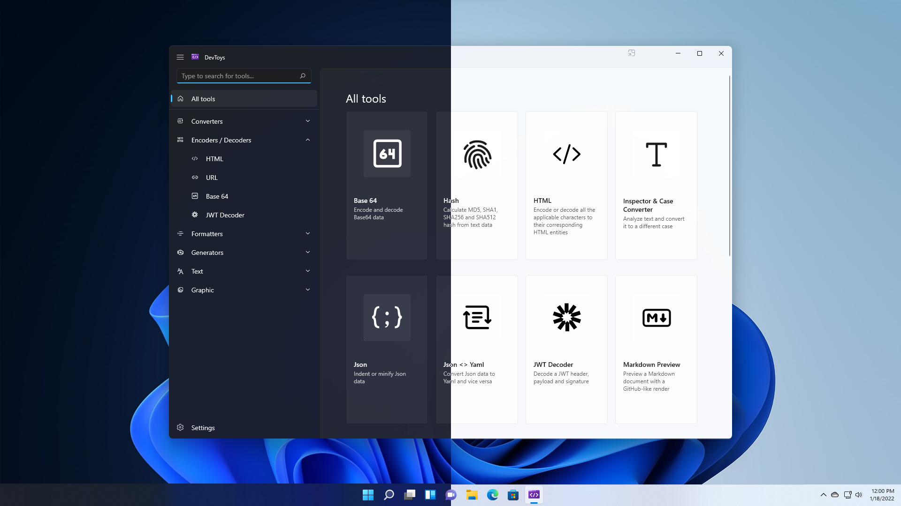
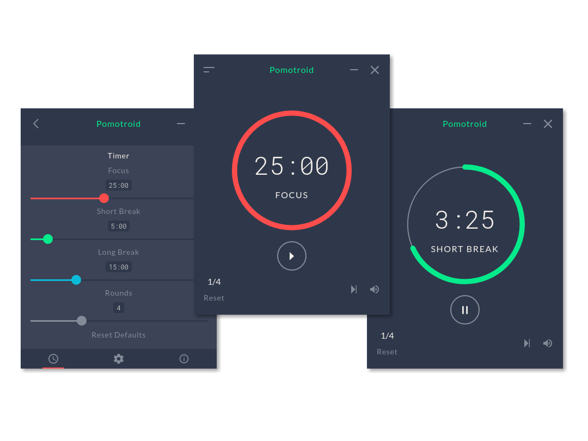

- [Play: record all the interesting project and ideas](#play-record-all-the-interesting-project-and-ideas)
  - [23-02](#23-02)
    - [oh-my-posh:full\_moon\_with\_face:](#oh-my-poshfull_moon_with_face)
    - [DevToys](#devtoys)
    - [chinese-independent-blogs:full\_moon\_with\_face:](#chinese-independent-blogsfull_moon_with_face)
    - [ChatGPT](#chatgpt)
    - [devguide](#devguide)
    - [numpy-100:full\_moon\_with\_face:](#numpy-100full_moon_with_face)
  - [23-01](#23-01)
    - [pomotroid](#pomotroid)
  - [22-10](#22-10)
    - [30-Days-Of-JavaScript:full\_moon\_with\_face:](#30-days-of-javascriptfull_moon_with_face)
    - [Compilers:full\_moon\_with\_face:](#compilersfull_moon_with_face)
    - [The Missing Semester of Your CS Education:full\_moon\_with\_face:](#the-missing-semester-of-your-cs-educationfull_moon_with_face)
    - [计算机科学速成课:full\_moon\_with\_face:](#计算机科学速成课full_moon_with_face)
    - [Miniflux 2:full\_moon\_with\_face:](#miniflux-2full_moon_with_face)
    - [Stable Diffusion:full\_moon\_with\_face:](#stable-diffusionfull_moon_with_face)
    - [Remote work](#remote-work)
    - [Wowchemy:full\_moon\_with\_face:](#wowchemyfull_moon_with_face)
    - [Maigret](#maigret)
  - [22-05](#22-05)
    - [warpd](#warpd)
    - [rubiks-cube](#rubiks-cube)
    - [dnsguide](#dnsguide)
    - [vcard-personal-portfolio](#vcard-personal-portfolio)
    - [rCore-Tutorial-Book](#rcore-tutorial-book)
    - [Bash-Oneliner](#bash-oneliner)
  - [22-04](#22-04)
    - [hashcat](#hashcat)
    - [Monitorian](#monitorian)
    - [reveal.js](#revealjs)
    - [awesome-phd-advice](#awesome-phd-advice)
    - [wiki.js](#wikijs)
  - [22-03](#22-03)
    - [chibicc](#chibicc)
    - [pure bash bible](#pure-bash-bible)
    - [How to Cook](#how-to-cook)
    - [Article](#article)
  - [22-02](#22-02)
    - [tinyssh](#tinyssh)
    - [LiveCharts2](#livecharts2)
    - [JetBrainsMono](#jetbrainsmono)
  - [22-01](#22-01)
    - [quadsort](#quadsort)
    - [minilisp ~hard and boring!!!~ Jump to chibicc](#minilisp-hard-and-boring-jump-to-chibicc)


# Play: record all the interesting project and ideas

This project is used for recording all project and ideas which I'm interested in. All those interesting projects has many sources, like project [hello-github](https://hellogithub.com/) or everywhere. And the ideas come from everywhere.

## 23-02

### [oh-my-posh](https://github.com/JanDeDobbeleer/oh-my-posh):full_moon_with_face:

A blazing fast cross platform/shell prompt renderer.


### [DevToys](https://github.com/veler/DevToys)

DevToys helps in daily tasks like formatting JSON, comparing text, testing RegExp. No need to use many untruthful websites to do simple tasks with your data. With Smart Detection, DevToys is able to detect the best tool that can treat the data you copied in the clipboard of your Windows. Compact overlay lets you keep the app in small and on top of other windows. Multiple instances of the app can be used at once.



### [chinese-independent-blogs](https://github.com/timqian/chinese-independent-blogs):full_moon_with_face:

中文独立博客列表

### [ChatGPT](https://github.com/lencx/ChatGPT)

ChatGPT Desktop Application (Mac, Windows and Linux) that is simply a website wrapper that extends the functionality of the original website.

### [devguide](https://github.com/python/devguide)

This guide covers how to contribute to CPython. It is known by the nickname of "the devguide" by the Python core developers.

### [numpy-100](https://github.com/rougier/numpy-100)

This is a collection of numpy exercises from numpy mailing list, stack overflow, and numpy documentation. I've also created some problems myself to reach the 100 limit. The goal of this collection is to offer a quick reference for both old and new users but also to provide a set of exercises for those who teach. For extended exercises, make sure to read [From Python to NumPy](http://www.labri.fr/perso/nrougier/from-python-to-numpy/).

## 23-01

### [pomotroid](https://github.com/Splode/pomotroid)

Pomotroid is a simple and configurable Pomodoro timer. It aims to provide a visually-pleasing and reliable way to track productivity using the Pomodoro Technique.


## 22-10

### [30-Days-Of-JavaScript](https://github.com/Asabeneh/30-Days-Of-JavaScript):full_moon_with_face:

30 days of JavaScript programming challenge is a step-by-step guide to learn JavaScript programming language in 30 days. This challenge may take more than 100 days, please just follow your own pace.

### Compilers:full_moon_with_face:

- [Harvard CS153 Compilers](https://www.bilibili.com/video/BV1cT4y197hW?share_source=copy_web&vd_source=ab7451f5b47a47ebe1d2419b7091329a)
  - 作业+课件: 链接: https://pan.baidu.com/s/1xyiQYyLqy3u9TqvTL_Dhcw 提取码: aflc（stored in the Baidu Netdisk /编译原理/compiler_course.zip）

- [Compiler Construction, Sacramento State CSC 151  (Shobaki)](https://www.bilibili.com/video/BV1uJ41187bj?share_source=copy_web&vd_source=ab7451f5b47a47ebe1d2419b7091329a)
  - 学这个之前, 推荐先去学一下视频里提到的theory of computation
  - [【Theory of Computation & Automata Theory】 ](https://www.bilibili.com/video/BV1T4411g7iR?share_source=copy_web&vd_source=ab7451f5b47a47ebe1d2419b7091329a)
  - [【计算理论】加州戴维斯 Theory of Computation (Phillip Rogaway)](https://www.bilibili.com/video/BV1Nt41167aE?share_source=copy_web&vd_source=ab7451f5b47a47ebe1d2419b7091329a)
- 计算理论很重要吗？

### [The Missing Semester of Your CS Education](https://github.com/missing-semester/missing-semester):full_moon_with_face:

The Missing Semester of Your CS Education. This project is course of MIT and very interesting and useful.

### [计算机科学速成课](https://github.com/1c7/Crash-Course-Computer-Science-Chinese):full_moon_with_face:

This project is Chinese translation of the course. The course introduces all subjects of computer science quickly, simply, precisely, and briefly.

### [Miniflux 2](https://github.com/miniflux/v2):full_moon_with_face:

Miniflux is a minimalist and opinionated feed reader:

- Written in Go (Golang)
- Works only with Postgresql
- Doesn't use any ORM
- Doesn't use any complicated framework
- Use only modern vanilla Javascript (ES6 and Fetch API)
- Single binary compiled statically without dependency
- The number of features is voluntarily limited

It's simple, fast, lightweight and super easy to install.

### [Stable Diffusion](https://github.com/CompVis/stable-diffusion):full_moon_with_face:

This project provide a AI model, which can generates pictures by text. You need to input a text description and get a picture generated by this model.

```python
# make sure you're logged in with `huggingface-cli login`
from torch import autocast
from diffusers import StableDiffusionPipeline

pipe = StableDiffusionPipeline.from_pretrained(
	"CompVis/stable-diffusion-v1-4", 
	use_auth_token=True
).to("cuda")

prompt = "a photo of an astronaut riding a horse on mars"
with autocast("cuda"):
    image = pipe(prompt)["sample"][0]  
    
image.save("astronaut_rides_horse.png")
```


### Remote work

[remote working ](https://github.com/greatghoul/remote-working): 主要用于整理中国国内的资源或者对国内受众友好的国外资源

[remote jobs](https://github.com/remoteintech/remote-jobs): A list of semi to fully remote-friendly companies in or around tech.

### [Wowchemy](https://wowchemy.com/zh/):full_moon_with_face:

基于Hugo的开源网站搭建器，创建网站的绝佳平台

### [Maigret](https://github.com/soxoj/maigret)

**Maigret** collects a dossier on a person **by username only**, checking for accounts on a huge number of sites and gathering all the available information from web pages. No API keys required. Maigret is an easy-to-use and powerful fork of [Sherlock](https://github.com/sherlock-project/sherlock).

## 22-05

### [warpd](https://github.com/rvaiya/warpd)
用键盘代替鼠标的工具。拥有多种操作模式比如方向键移动鼠标和区域选择，但仅支持 Linux 和 macOS 系统


### [rubiks-cube](https://github.com/pengfeiw/rubiks-cube)
使用 Three.js 制作的 3D 魔方。支持自定义魔方阶数，[在线尝试](https://pengfeiw.github.io/rubiks-cube/)


### [dnsguide](https://github.com/EmilHernvall/dnsguide)
DNS server totally writen by Rust

### [vcard-personal-portfolio](https://github.com/codewithsadee/vcard-personal-portfolio)
vCard is a fully responsive personal portfolio website, responsive for all devices, built using HTML, CSS, and JavaScript.


### [rCore-Tutorial-Book](https://github.com/rcore-os/rCore-Tutorial-Book-v3)
用 Rust 语言从零开始写一个基于 RISC-V 架构的类 Unix 内核。清华大学开源的中文教程，从计算机发展历史开始科普，一步步说到为何操作系统会>诞生，以及现代操作系统必须具备的特性。实践方面也是从空文件夹开始，像搭乐高积木一样，慢慢将操作系统的核心开发出来，教程读起来简直像看>小说一样让人欲罢不能

### [Bash-Oneliner](https://github.com/onceupon/Bash-Oneliner)
Simple bash commands for parsing data and Linux system maintenance. [Online](https://onceupon.github.io/Bash-Oneliner/)

## 22-04
### [hashcat](https://github.com/hashcat/hashcat)
hashcat is the world's fastest and most advanced password recovery utility, supporting five unique modes of attack for over 300 highly-optimized hashing algorithms. hashcat currently supports CPUs, GPUs, and other hardware accelerators on Linux, Windows, and macOS, and has facilities to help enable distributed password cracking.
```
安装：brew install hashcat
常用参数：
-a  指定破解模式：“-a 0”字典攻击，“-a 1” 组合攻击；“-a 3”掩码攻击
-m  指定要破解的 hash 类型：默认为 MD5
--force 忽略破解过程中的警告
常用破解模式：
0：Straight（字典破解）
1：Combination（组合破解）
3：Brute-force（掩码暴力破解）
6：Hybrid Wordlist + Mask（字典+掩码破解）
7：Hybrid Mask + Wordlist（掩码+字典破解）
常用掩码设置：
l：纯小写字母 abcdefghijklmnopqrstuvwxyz
u：纯大写字母 ABCDEFGHIJKLMNOPQRSTUVWXYZ
d：纯数字 0123456789
举例：破解 8 位数字密码
hashcat -a 3 -m 0 --force 0D7002A70CCDE8BF4BA2A4A5572A85E9(密码md5字符串) ?l?l?l?l?l?l?l?l?l?l?l（11 位密码的掩码）
```


### [Monitorian](https://github.com/emoacht/Monitorian)
Monitorian is a Windows desktop tool to adjust the brightness of multiple monitors with ease.


### [reveal.js](https://github.com/hakimel/reveal.js)
reveal.js is an open source HTML presentation framework. It enables anyone with a web browser to create beautiful presentations for free. 


### [awesome-phd-advice](https://github.com/pliang279/awesome-phd-advice)
Collection of advice for prospective and current PhD students. 


### [wiki.js](https://github.com/requarks/wiki)
Wiki.js | A modern and powerful wiki app built on Node.js. Help you build your own website like wiki. It's simple and fast website building tool.

## 22-03
### [chibicc](https://github.com/rui314/chibicc)
A small C compiler. It's fun to read it from the [first commit](https://github.com/rui314/chibicc/commit/0522e2d77e3ab82d3b80a5be8dbbdc8d4180561c)

### [pure bash bible](https://github.com/dylanaraps/pure-bash-bible)
It's a book which documents commonly-known and lesser-known methods of doing various tasks using only built-in `bash` features.

### [How to Cook](https://github.com/Anduin2017/HowToCook)
Programmer's guide about how to cook at home (Chinese only).[Related website](https://cook.aiurs.co/)

### [Article](https://github.com/HelloGitHub-Team/Article)
This is a collection of articles that guide beginners on their first project in Github.

## 22-02
### [tinyssh](https://github.com/janmojzis/tinyssh)
极简 SSH 服务器。为了便于学习仅保留了基础功能，而且抛弃了较旧的加密算法。该项目的学习价值大于实用价值，适合对 SSH 和加密知识感兴趣的小伙伴

### [LiveCharts2](https://github.com/beto-rodriguez/LiveCharts2)
简单、灵活、强大的 .Net 图表库。支持 WPF、WinForms、WinUI、UWP 等


### [JetBrainsMono](https://github.com/JetBrains/JetBrainsMono)
JetBrains 为开发者开源的免费字体。该字体形状简单没有不必要的细节，从而阅读起来十分轻松而且小尺寸时显示更加清晰


## 22-01

### [quadsort](https://github.com/scandum/quadsort)
一种比快速排序快，稳定的归并排序算法。项目包含原理讲解、C 语言实现、性能对比和排序过程


### [minilisp](https://github.com/rui314/minilisp) ~hard and boring!!!~ Jump to [chibicc](#chibicc)
用 1000 行 C 语言写的 Lisp 解释器。实现了整数、符号、局部变量、条件语句、宏和垃圾回收等功能，为了让读者更好地理解项目，代码中包含了丰富的注释
```
(println 3)  ; prints "3"
(+ 1 2 3)  ; -> 6
(define a (+ 1 2))
(+ a a)  ; -> 6
```

[def]: #minilisp-hard-and-boring-jump-to-chibicc